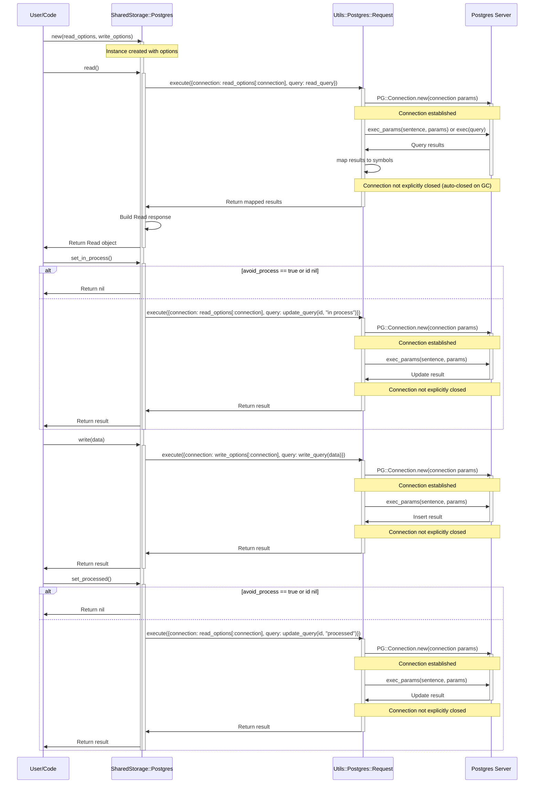

# SharedStorage::Postgres

## Sequence Diagram

```mermaid
sequenceDiagram
    participant User as User/Code
    participant SS as SharedStorage::Postgres
    participant Req as Utils::Postgres::Request
    participant PG as Postgres Server

    User->>SS: new(read_options, write_options)
    activate SS
    Note over SS: Instance created with options

    User->>SS: read()
    activate SS
    SS->>Req: execute({connection: read_options[:connection], query: read_query})
    activate Req
    Req->>PG: PG::Connection.new(connection params)
    activate PG
    Note over Req,PG: Connection established
    Req->>PG: exec_params(sentence, params) or exec(query)
    PG->>Req: Query results
    Req->>Req: map results to symbols
    deactivate PG
    Note over Req,PG: Connection not explicitly closed (auto-closed on GC)
    Req->>SS: Return mapped results
    deactivate Req
    SS->>SS: Build Read response
    SS->>User: Return Read object
    deactivate SS

    User->>SS: set_in_process()
    activate SS
    alt avoid_process == true or id nil
        SS->>User: Return nil
    else
        SS->>Req: execute({connection: read_options[:connection], query: update_query(id, "in process")})
        activate Req
        Req->>PG: PG::Connection.new(connection params)
        activate PG
        Note over Req,PG: Connection established
        Req->>PG: exec_params(sentence, params)
        PG->>Req: Update result
        deactivate PG
        Note over Req,PG: Connection not explicitly closed
        Req->>SS: Return result
        deactivate Req
        SS->>User: Return result
    end
    deactivate SS

    User->>SS: write(data)
    activate SS
    SS->>Req: execute({connection: write_options[:connection], query: write_query(data)})
    activate Req
    Req->>PG: PG::Connection.new(connection params)
    activate PG
    Note over Req,PG: Connection established
    Req->>PG: exec_params(sentence, params)
    PG->>Req: Insert result
    deactivate PG
    Note over Req,PG: Connection not explicitly closed
    Req->>SS: Return result
    deactivate Req
    SS->>User: Return result
    deactivate SS

    User->>SS: set_processed()
    activate SS
    alt avoid_process == true or id nil
        SS->>User: Return nil
    else
        SS->>Req: execute({connection: read_options[:connection], query: update_query(id, "processed")})
        activate Req
        Req->>PG: PG::Connection.new(connection params)
        activate PG
        Note over Req,PG: Connection established
        Req->>PG: exec_params(sentence, params)
        PG->>Req: Update result
        deactivate PG
        Note over Req,PG: Connection not explicitly closed
        Req->>SS: Return result
        deactivate Req
        SS->>User: Return result
    end
    deactivate SS

    deactivate SS
```